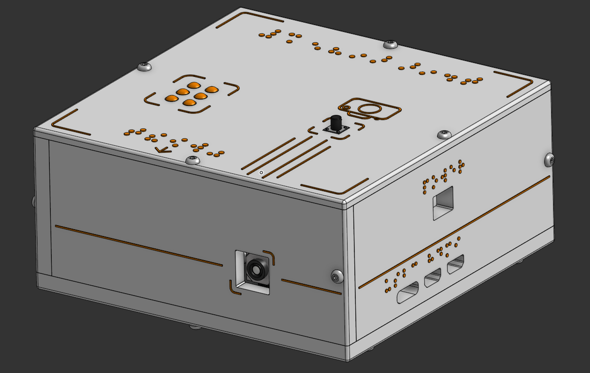
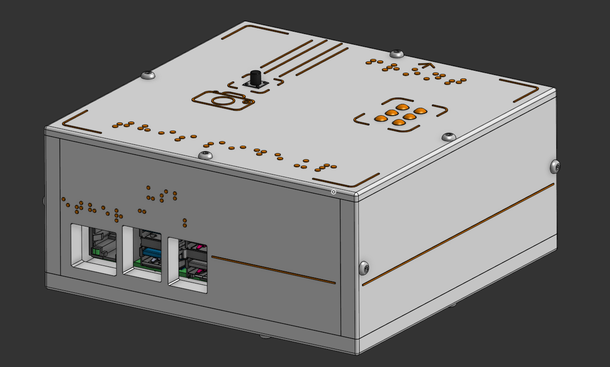
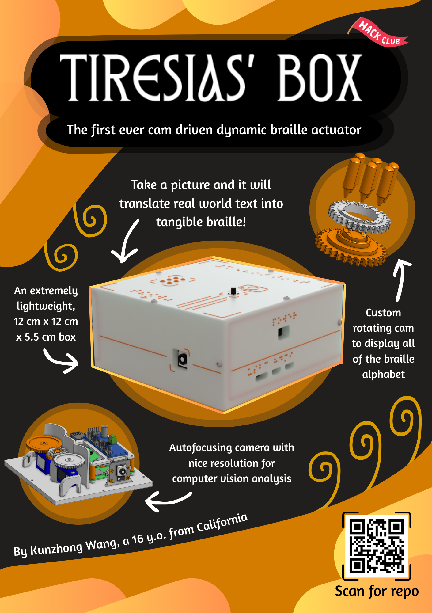

# Tiresias' Box

A portable, dynamic braille translator for both English and Chinese that incorporates an idea for changeable braille never been presented before. This is the first ever braille actuator cell that uses CAM mechanisms to change the positions of the braille dots.

Front  

Back  

# Overview

This is a fun box that has a feature to take pictures of where its camera is pointing and then extracts the English or Chinese text it sees in real life to translate into braille in the braille area on top of the box. This box is only about 12 cm x 12 cm x 5.5 cm large and is very light. The white and orange design of the box was inspired by FRC 118 Robonauts, the team that got me into the white and orange design colors. The extremely easy assembly makes this a very beginner friendly project that even me, a complete beginner, could build with ease.

# Highlights

* **Custom Rotating CAM Braille Actuators**: The heart of this project, which are two custom made independent rotating CAMs stacked on top of each other which is able to change the orientations of the pins to be able to output every letter in the braille alphabet.  
* **Nicely-Scaled Braille Pins**: These small 3D printed custom pins are always in direct contact with the CAMs and are driven by nature’s most natural force, gravity. These pins are extremely light and gravity is all they need to be able to move with the CAM. They are also a good size to be felt with a single finger.  
* **Autofocus Raspberry Pi Camera Module 3**: Camera that does not require manual focusing and can take pictures of its surroundings in high detail and resolution to help with text extraction and analysis.  
* **Raspberry Pi 5**: The Raspberry Pi and the fact that all the mechanisms that drive that this project are connected to it makes this project very customizable. The Raspberry Pi allows for extremely fast live processing and analysis as well as file storage and servo control. Other people wanting to make this project can add onto the preexisting code as well as connect other mechanisms to widen the capabilities of this box.  
* **Blind Friendly** **Usage**: All of the ports and other important parts of the box are labeled with real braille which can be read by blind people. Although this box is not the most practical design currently, it is still able to be used completely by blind people.
* **Both Chinese Simplified And English Support**: This little box is able to both extract English text as well as Chinese Simplified characters and translating it to English, covering two of the biggested languages in the world.  

Custom braille CAM actuators  

# Why?

Let’s first talk about why this is called Tiresias' Box. If you are a Greek mythology fanatic like I am, you would instantly recognize the all-knowing, blind prophet Tiresias. This person is an absolute legend and is one of the most knowledgeable Greek mythology characters. I wanted to create a project to help the blind as this disability should not be a limiting factor for their potential to do great things, just like Tiresias. 

This project helps solve the real world problem of blind people not being able to read words in the world, whether that is street signs, a restaurant menu, or something in the newspaper. It uses a camera and computer vision to restore their sight, translating the words they are unable to see into a format they are very familiar with, braille. Making this project as small as possible also helps take one step closer to this being a practical, portable device that people can bring wherever they go, actually helping them in the real world.

However, some people may have many questions about this project such as why not just use speakers? Personally, my answer to that is that speaking out words in the real world already exist and are more efficient than ever. Almost all phones have apps that can do this better than any personal project and they can even connect any external headphones to the phones.

Another question people may ask is how is this different from existing dynamic braille actuators? This is my unique approach to dynamic braille which incorporates CAM mechanisms to change the braille rather than some existing designs such as using a separate motor for every single braille dot, electromagnetic actuators, and even braille driven by fluids. Some of the main goals that I hoped to accomplish is using as few motors as possible and making the braille dots move both smoothly but also stay rigidly in place when people’s fingers are moving over them and pressing down on them. Many electromagnetic designs are not strong enough to hold up the force of people’s fingers on the braille. I thought of a custom rotating CAM mechanism that essentially has rises and drops in the CAM that drives the pin's braille pins to move up and down. The braille pins are also in constant contact with the CAM due to their light weight and force due to gravity so they will have more than enough normal force to withstand people’s fingers. Furthermore, I separated the CAMs into an inner and outer CAM which lessened the amount of motors to drive the braille down to two servos to control the movement of six pins. This is what makes this design different from all the current designs.

Lastly, I love computer vision. I always do the computer vision algorithms on my robotics team and I have always found its applications endless and all the different parts of it super intriguing. If I do a project, it would not be mine if it did not include any computer vision 🙂.

# How To Use

This project is extremely easy to use, only consisting of a button that you would need to press and the code ran from the Raspberry Pi. If you did the run script upon power up command from the software setup steps, this project would essentially be similar to any project you would find for sale. However, if you didn’t do that step, you would need to run the main.py file in the firmware folder in the Raspberry Pi.

Do these steps after you have properly assembled and set up the box please. They will not work otherwise.

1. Plug the USB-C power source into the Raspberry Pi through the USB-C port opening and the 5V power source into the PCA9685 through the opening to the top right of the USB-C opening.  
2. Boot up the Raspberry Pi and wait for about 5 seconds for the camera to start up and adjust to its surroundings and the braille to move to its initial positions, and you are ready to use it\!  
3. Press the button to take a picture of whatever is in front of it and the dynamic braille will automatically change depending on the letters that it sees. It will go in order from left to right to the letters/words it sees, first displaying the leftmost letter, then changing to the next letter, and so on until all the text is displayed. Each character will stay for about 2 seconds until the next one is displayed.  
4. After all the text is displayed and the braille is no longer changing, you will be able to take another photo of different text and it will show that text. No need to worry about memory of the photos as after each translation, the photos that you have taken will be deleted to save storage. 
5. Press and hold the button for about 3 seconds and the box will be able to toggle translate from Chinese to English or purely English for the photos that the user takes. The braille that is displayed will be in English. Press and hold the button to switch the detection model. The inital model will only extract English; the next toggle will be able to translate.
5. Press and hold the button for about 6 seconds and the code will stop and the camera will power off. Make sure you do this every time to ensure the code stops properly and the camera powers off nicely. Directly cutting the power may wear the Pi and the camera unnecessarily and is bad practice.  
6. After doing so, you can power off your Raspberry Pi and unplug the external power supplies.

Where the external power supplies should be plugged in  

# Hardware

| Component | Notes |
| :---- | :---- |
| Raspberry Pi 5 | For running the code, storing files, live computer vision analysis, being the brain of the whole project. |
| Adafruit PCA9685 Servo Driver | Running servos separately of the Raspberry Pi to lessen its load and prevent the risk of frying the Pi due to the servos. |
| Raspberry Pi 27W USB-C PSU | For powering the Raspberry Pi |
| 5V 2A power supply | For powering the PCA9685 |
| Raspberry Pi Camera Module 3 Standard \- 12MP Autofocus | Autofocus camera that is able to take high resolution photos for efficient computer vision analysis. |
| SG90 9g Digital Micro Servo | To move the CAM mechanisms. |
| 6mm 2 Pin Panel PCB Momentary Tactile Tact Push Button | To control when to take pictures, change the braille, and turn off the code. |
| 16GB+ Micro SD Card | Store files and the Raspberry Pi OS. |

You can find more detailed buying links and prices of these components as well as other materials not listed here in the Bill Of Materials.

# About EasyOCR and Deep Translator

These are the two main Python libraries that I used in my project and are also integral parts of many other everyday applications. EasyOCR is a library that runs Optical Character Recognition which often built on neural networks to help detect text in real life, and then convert it to the string characters that we see on our computers. This software has been around for some time and is used for the text extraction for scanning documents on our phones, finding text in photos, and much more. In my project, the library EasyOCR is dircetly able to be used in Python and it utilizes PyTorch which is one of the biggest machine learning frameworks for Python currently. Every time the code runs, EasyOCR creates a model based on certain parameters to help you detect text. Due to the constraints for Raspberry Pi (yes, even this had constraints), my idea of being able to translate both English and Chinese using two different reader models was not feasible since a model consumes a lot of RAM each (we're saying from 1-3GB spikes) and I don't have much. Therefore, I was able to combine these two languages into a single model, as well as use a quantized model (using 8-bit integers for optimizing how much numerical precision the model outputs) to reduce the latency and improve the processing speed and efficiency. Since the Raspberry Pi is mainly using CPU for processing, the model also supports that and using a quanitized model helps with smaller RAM and CPU processing; it initially uses GPU and VRAM but Raspberry Pi does not support this. This model is essentially a neural network that runs every time for a image; downloading this model alone also takes up some storage and uses RAM, but it is less than actually running processing in the model. Well, if that isn't enough, let's introduce Deep Translator. This library allows us to use multiple different translation API clients such as Google Translate, which was used in this project. If there are any RAM concerns about this library, it does not do a lot of heavy lifting like the computer vision OCR pipelines above and it does use cloud clients which makes its processing even lighter. Therefore, its RAM usage is almost negligible and the RAM can be focused on running OCR. Both these libraries are integral parts of my project and it would not be possible without them. Please check out their documentation, they are genuinely so interesting and I hope you will find them useful in many of your future projects as well.
EasyOCR: [https://www.jaided.ai/easyocr/](https://www.jaided.ai/easyocr/), here's also the [github repo](https://github.com/JaidedAI/EasyOCR)
Deep Translator: [https://deep-translator.readthedocs.io/en/latest/](https://deep-translator.readthedocs.io/en/latest/)

# Assembly instructions

Make sure to finish the [software setup instructions](resources/software_setup.md) before continuing onto the [hardware setup instructions](resources/hardware_setup.md). You can find the same [wiring diagram](resources/wiring%20diagram.jpg) in the resources folder.   
Just to clarify a few things, for the PCA9685, the ground wire goes to the ground pin on the Raspberry Pi, the SCL wire goes to the SCL pin, the SDA wires goes to the SDA pin, and the VCC wire goes to the 3.3v pin.  
The button’s wires can be routed in any way to the GPIO5 and the ground pin next to it.

Wiring Diagram  

# V1 Testing

Testing for proof of concept:

# Credits

All 3D Models cadded with Onshape.

The incredible YouTube videos that taught me along the way:

* [https://www.youtube.com/watch?v=GwpSpOwvx9Y\&t=1s](https://www.youtube.com/watch?v=GwpSpOwvx9Y&t=1s)  
* [https://www.youtube.com/watch?v=-x2EEIUMm6A](https://www.youtube.com/watch?v=-x2EEIUMm6A)  
* [https://www.youtube.com/watch?v=XPpw5P6AoEA](https://www.youtube.com/watch?v=XPpw5P6AoEA)  
* [https://www.youtube.com/watch?v=w-4V\_q8XWtk](https://www.youtube.com/watch?v=w-4V_q8XWtk)  
* [https://www.youtube.com/watch?v=Gl9HS7-H0mI](https://www.youtube.com/watch?v=Gl9HS7-H0mI)

# The Future

Currently, my project requires the box to be upright since it relies on the pin’s light weight and gravity for the CAM to move the braille pins. The pins are also able to be switched out easily by just plucking them out of the holes. However, in the future, I would want the box to be able to work in every single orientation, even when upside down. This made me think to either use very small springs or even make them magnetic to the CAM. I have researched these ideas and the small springs were very difficult to find for my tiny pins and the magnetic CAM is not possible since I only have a plastic 3D printer and no CNC or laser cutter.

I also would like the whole box to be even smaller and compact to make it even more portable and practical for every day use.

I would also like to make the CAM and pins even smoother. Right now, even using a 0.2 mm nozzle and the thinnest slicer settings, there are still layer lines on my prints. I want to eliminate those entirely in the future using some of those more advanced ways to get these custom 3D parts.

# Contact

* Discord: eclipse\_c  
* Email: kevinkunzhong@gmail.com

# Zine

The [PDF version](resources/fallout%20project%20zine.pdf) can be found in the resources folder.
